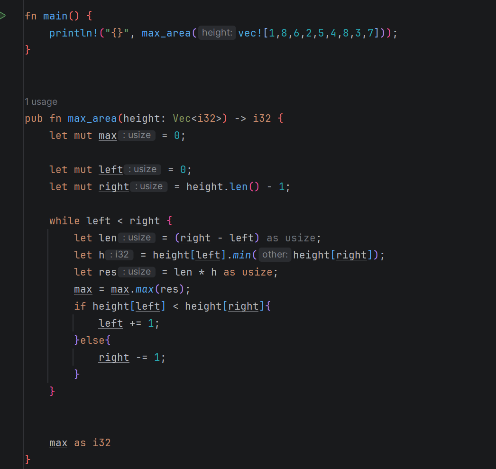
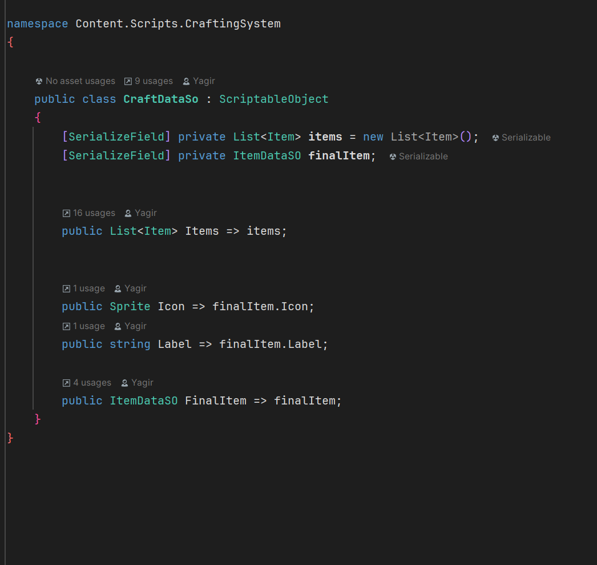

<table>
  <tr>
    <td width="110">
      
    </td>
    <td>
      <h1>
        <a href="https://plugins.jetbrains.com/plugin/29914-free-rainbow-brackets-delimiters">
            Free Rainbow Brackets (Delimiters)
        </a>
      </h1>
      <p>
        <b>Simplest delimiter coloring free!</b> Rainbow coloring for <code>()</code>, <code>[]</code>, <code>{}</code>
        based on nesting level. Works in RustRover, Rider, and other IntelliJ-based IDEs.
      </p>
    </td>
  </tr>
</table>

A lightweight alternative to paid “rainbow brackets” plugins: it colors matching brackets by nesting depth so you can read deeply nested code faster.

## Screenshot
<p align="center">
  
  
</p>

## Features

- Rainbow coloring for `()`, `[]`, `{}` by **nesting level**
- Skips **strings** and **comments** when possible (lexer-based; falls back to a manual parser where needed)
- Lightweight: highlights only the **visible area** (plus a small margin)
- No settings required — works out of the box

## Supported IDEs

This is a plain IntelliJ Platform plugin (editor-level highlighting), so it can work in many JetBrains IDEs:

- RustRover
- Rider
- IntelliJ IDEA / CLion / WebStorm / etc.

Compatibility is controlled by the **build number range** injected into `plugin.xml` during build (`sinceBuild` / `untilBuild` in `patchPluginXml`).

## Supported file types

The plugin is enabled for common code extensions (you can change the list in code):

- Rust: `.rs`
- C#: `.cs`
- JVM: `.java`, `.kt`, `.kts`
- C/C++: `.c`, `.h`, `.cc`, `.cpp`, `.cxx`, `.hpp`, `.hxx`
- JS/TS: `.js`, `.ts`, `.jsx`, `.tsx`
- Other: `.py`, `.go`, `.swift`, `lua`, `json`, `hlsl`, `shader`, `php`

To customize: edit `ENABLED_EXT` in `src/main/kotlin/dev/yaro/rainbowbraces/RainbowBracesEditorListener.kt`.

## Installation

### From JetBrains Marketplace

If/when the plugin is published, install it from **Settings → Plugins → Marketplace** and search for **Free Rainbow Braces**.

### From ZIP (local install)

1. Build the plugin ZIP (see “Build” below).
2. In your IDE: **Settings → Plugins → ⚙ → Install Plugin from Disk…**
3. Select the generated ZIP and restart the IDE.

## Development

### Run in a sandbox IDE

`runIde` starts a separate IDE instance (sandbox) with your plugin already loaded.

- From IntelliJ: run the Gradle task **`runIde`**
- Or from terminal:

```bash
./gradlew runIde
```

Then open any supported file (e.g., `test.rs`, `test.cs`) and type nested code to see the coloring.

### Build a distributable ZIP

```bash
./gradlew buildPlugin -x buildSearchableOptions
```

Output ZIP:

```
build/distributions/*.zip
```

> [!NOTE]
>- Rider C# editor is special (ReSharper backend). Some Rider builds expose fewer lexer/PSI features in the frontend editor.
>The plugin has a manual fallback, but behavior can still vary across Rider versions.
>- If you see “not compatible with IDE build …” during install, adjust the build range in `patchPluginXml` (`sinceBuild` / `untilBuild`) and rebuild the ZIP.

## Open Source
MIT
